# ue-3d-fantasy-game

This is a 3d fantasy hack and slash game made using Unreal Engine 4 and free assets found online (characters, animations, music, landscape) for the Game Development Fundamentals course at Seneca. The programming was done using Blueprints Visual Scripting. Various concepts were covered such as Animation Blueprints, HUD and Menu widgets, Landscape editing, Enemy AI for roaming and attacking, projectile spawning, collisions, camera switching, etc.

The player takes on the role of a paladin on a quest to kill an evil mage. There are 3 collectables which the player must obtain, while killing various enemies scattered around the map. The enemies are associated with a particular element (Fire, Ice, or Electricity) and the player can use 1 of these 3 types of magic at a time to damage the enemies (you can also use your sword if mana is low). Collect the statues, unlock the boss' lair and save your world!

Read the pdf for more info.

Developers: Tanvir Sarkar, Stephen Noble, Woosle Park, Anujan Sritharan

## Instructions

## Screenshots

### Main Menu
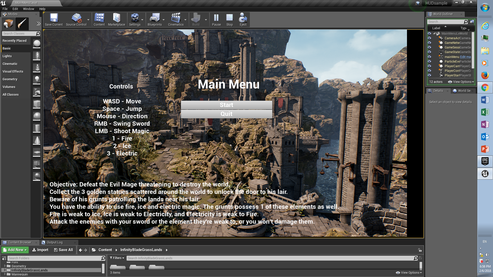

### Landscape Overview
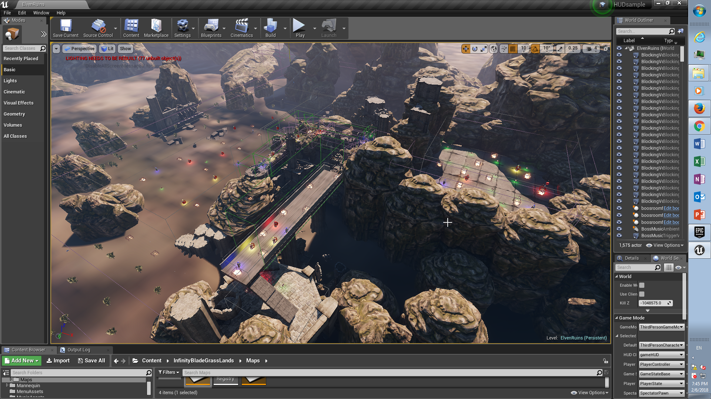

### Player Start
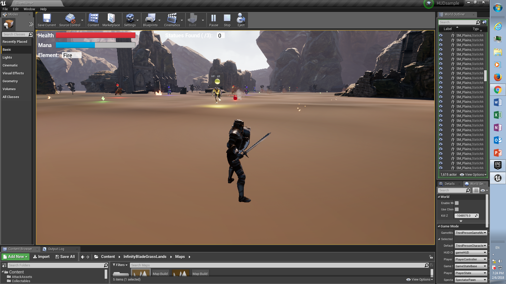

### Enemy Attack
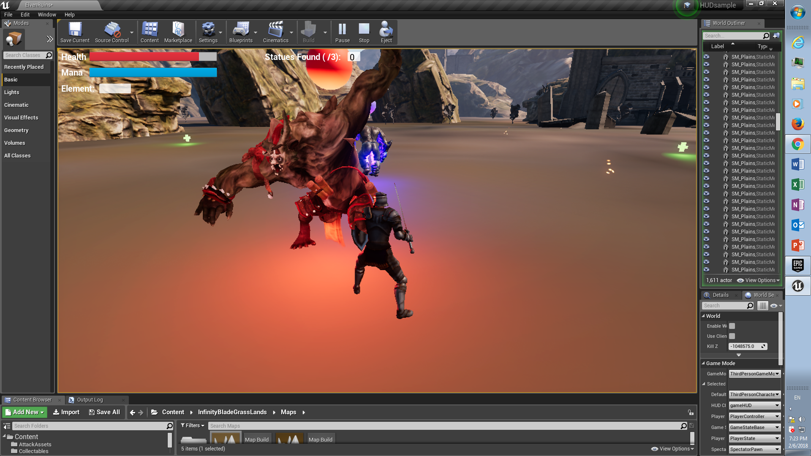

### Collectable
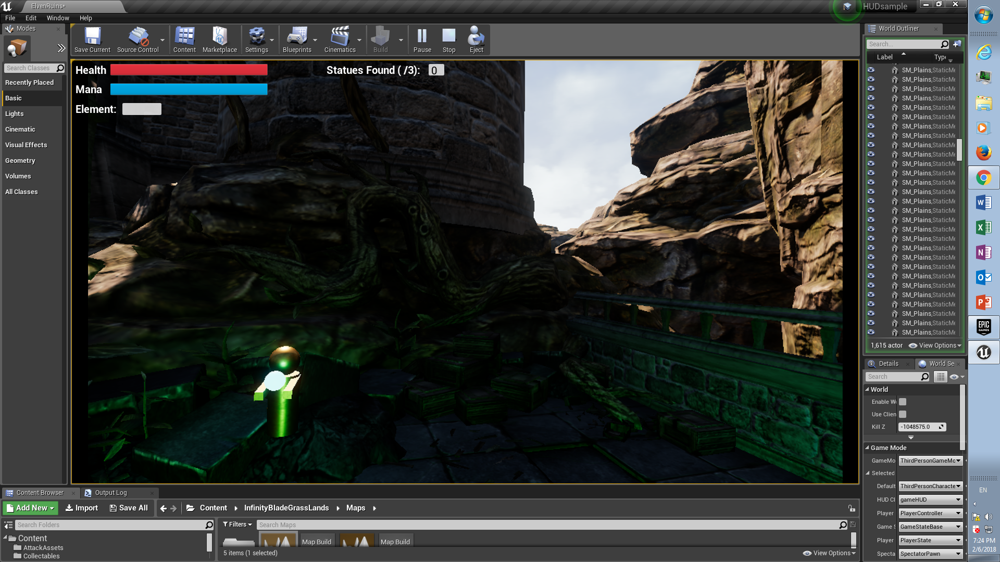

### Camera-Switch to Top Down View on a Bridge
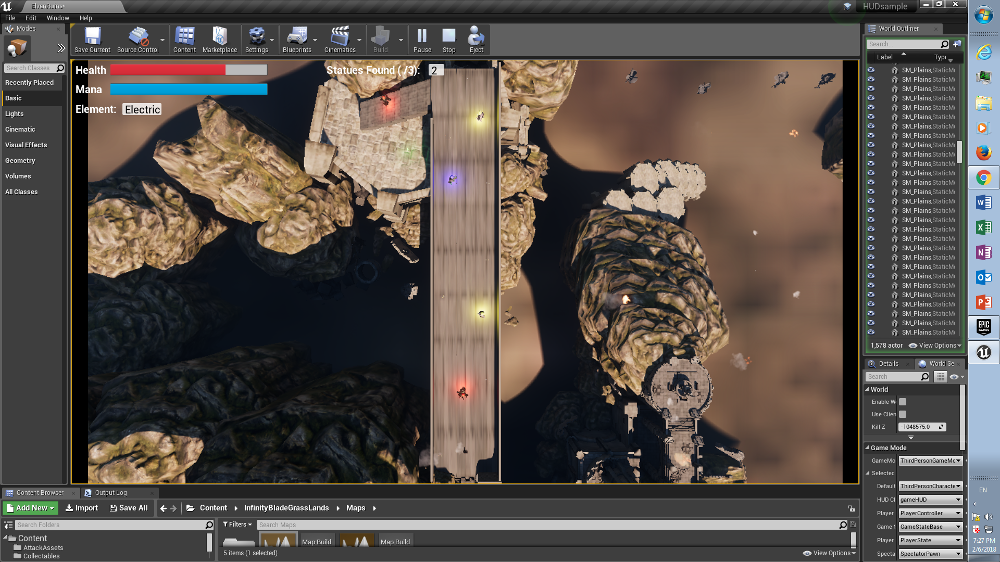

### Entrance to Boss' Lair
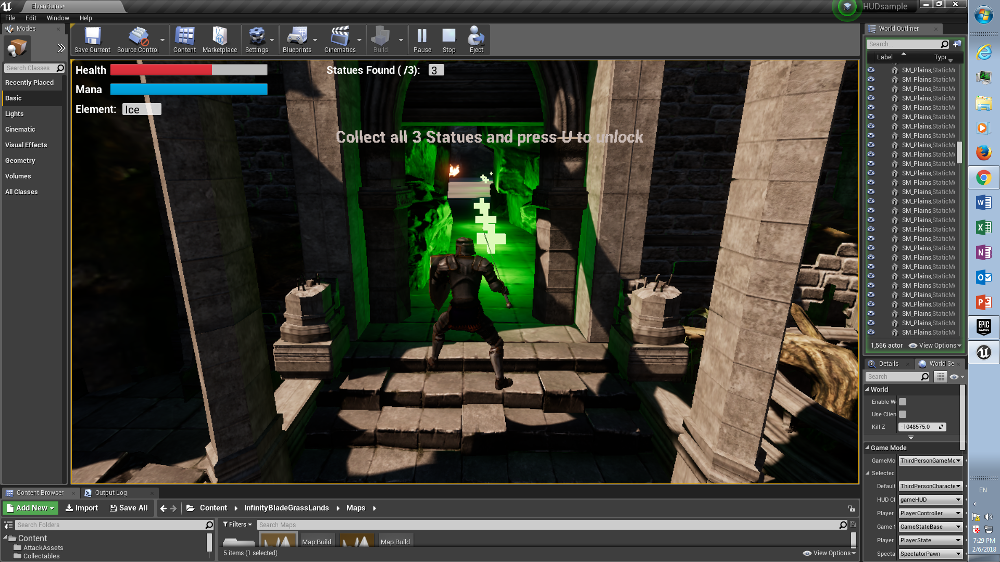

### Boss Fight 1
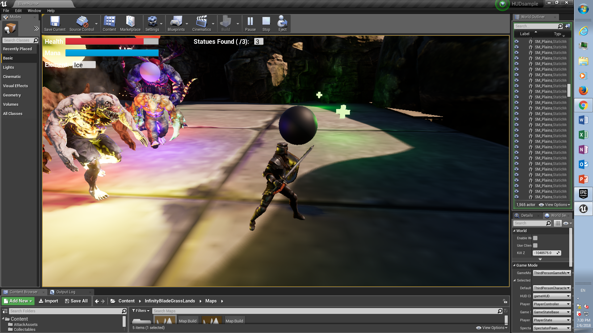

### Boss Fight 2
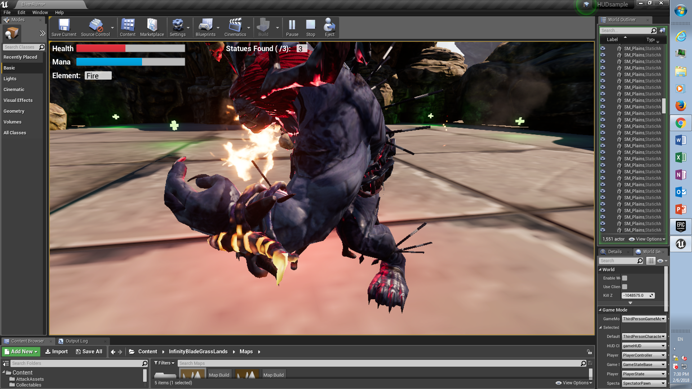

### Character Viewport 
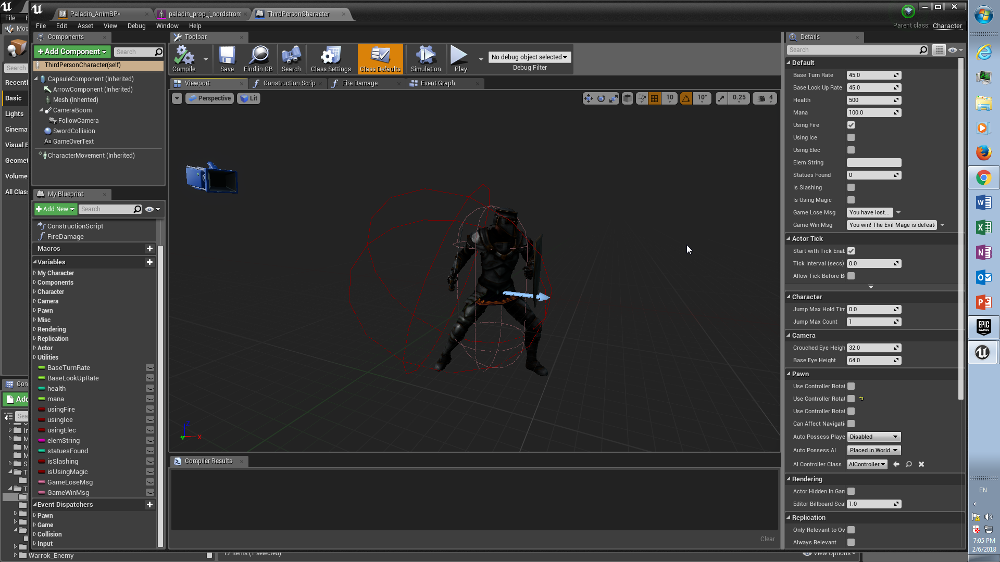

### Enemy Viewport
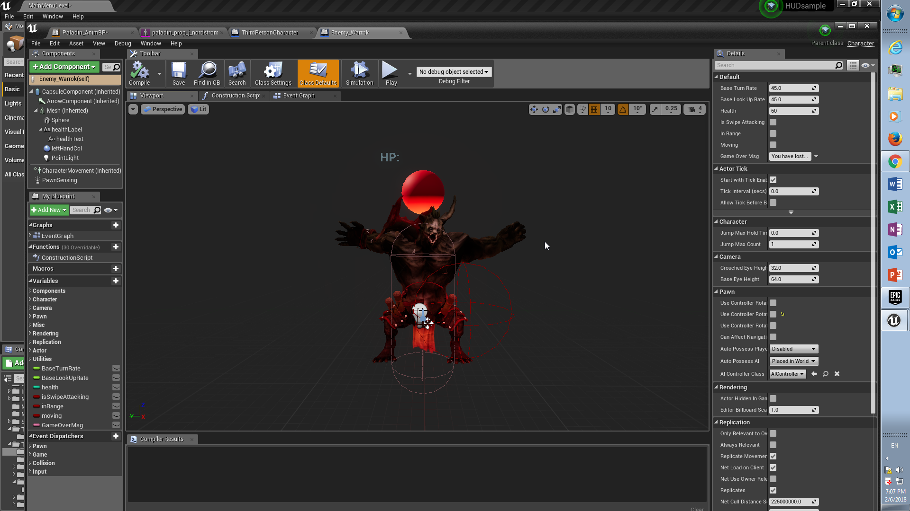

### Character Animation State Machine
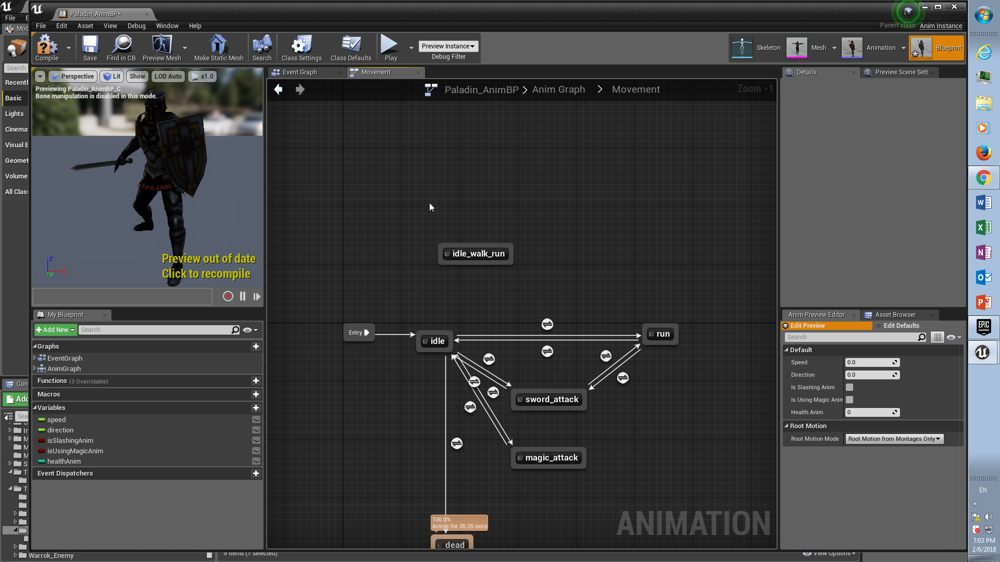

### Blueprint Segment - Character Magic Projectile Spawning
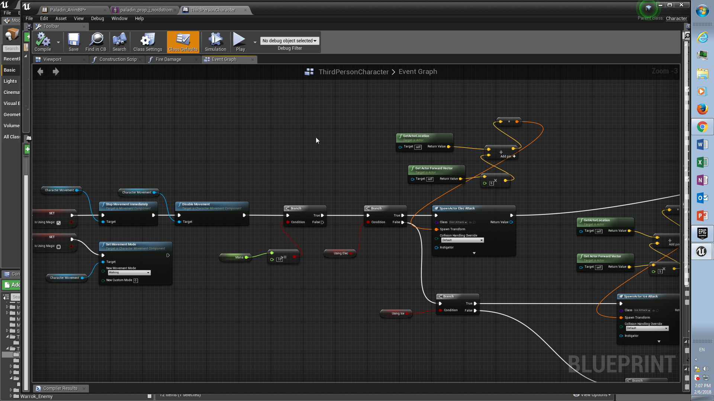

### Blueprint Segment - Enemy AI (Roam, Move to Player, Attack when in Range)
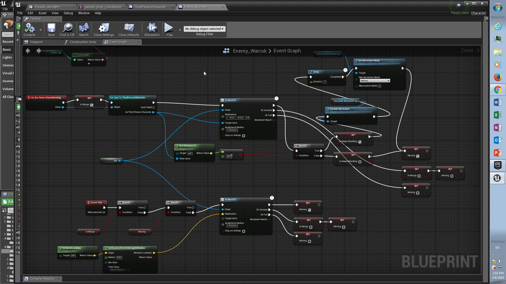

